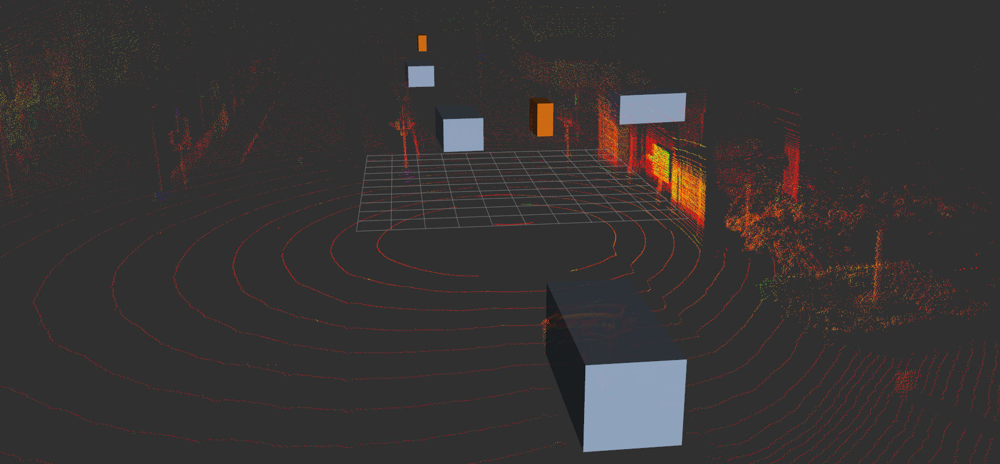

# SFA3D: CenterNet for 3D detection using point pillars

**Input representation:** 

non-learned bird's-eye view (BEV) [pillars](https://arxiv.org/abs/1812.05784) generated from point clouds.
Pillar features are max. intensity, max. height and point density (see `point_cloud_utils.rasterize_bev_pillars`). Default BEV resolution: 1216x608 px (100x50 m, -25 to 75 m and -25 to 25 m)

**Output representation:** 

[CenterNet](https://arxiv.org/abs/1904.07850)-like heatmaps for BEV object centers and regression maps for object dimensions (h, w, l) and orientation (sin(yaw), cos(yaw)). Anchor-free and fully-convolutional ([ResNet-18](https://arxiv.org/abs/1512.03385) + [Feature Pyramid](https://arxiv.org/abs/1612.03144)) -> adapts to different input resolutions

## How to build the docker image for inference
```bash
docker build -f ros.Dockerfile -t <IMAGE_NAME>:<IMAGE_TAG> .
```

## How to test the model locally
1. Get rosbag with PointCloud2 message named `/sensor/lidar/box_top/center/vls128_ap/points`
2. Start a `roscore` and `rviz`
3. Start the detection docker container with: 
    ```bash
    docker run -it --gpus all --net host --rm --name sfa3d <IMAGE_NAME>:<IMAGE_TAG>
    ```
4. Play the rosbag with a reduced frame rate 
    ```bash
    rosbag play -r 0.2 <ROSBAG_NAME>
    ```
5. Visualize the PointCloud2 and the BoundingBoxArray message `/perception/sfa3d/bboxes` in rviz. E.g.:
</img>

## How to retrain the model
Coming soon.

